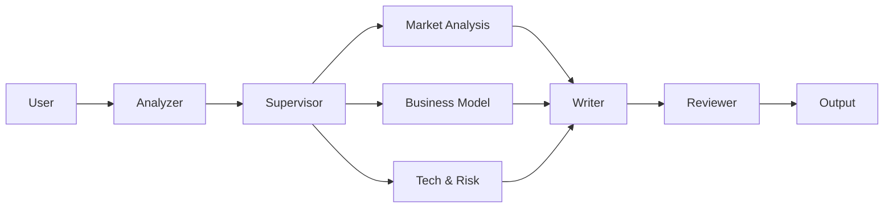

# 📋 PlanCraft Agent

> **AI 기반 웹/앱 서비스 기획서 자동 생성 Multi-Agent 시스템 (V2.1)**

[](https://langchain-ai.github.io/langgraph/)
[](https://www.python.org/)
[](https://streamlit.io/)
[](./LICENSE)

---

## 🎯 서비스 핵심 흐름

> 🎓 **과제 평가용 문서**: 시스템 설계 및 상세 리포트는 [**📑 PROJECT_REPORT.md**](docs/PROJECT_REPORT.md)를 참조해주세요.

사용자의 아이디어가 **전문 에이전트 팀**과 **Supervisor**의 협업을 통해 완벽한 기획서로 탄생합니다.



### ✨ 핵심 기능 (V2.1)

#### 1. **Plan-and-Execute 아키텍처**
단순 순차 실행이 아닌, **Supervisor**가 계획을 수립하고 **Specialist Agent**들이 병렬로 작업을 수행합니다.
*   📊 **Market Agent**: 시장 규모 및 경쟁사 심층 분석
*   💰 **BM Agent**: 수익 모델, 가격 정책, 가치 제안 설계
*   ⚖️ **Risk Agent**: 법적/기술적 리스크 및 SWOT 분석

#### 2. **스마트 입력 & HITL (Human-in-the-Loop)**
*   **간단한 질문**: AI가 챗봇처럼 즉시 답변.
*   **모호한 요청**: "사용자에게 되물어보기(Interrupt)" 기능을 통해 의도를 명확히 파악.
*   **제약조건 준수**: "광고 수익만 원함" 같은 사용자의 제약조건을 모든 에이전트가 준수.

#### 3. **품질 모드 (Quality Presets)**
*   🚀 **Fast**: 아이디어 스케치용 (차트 제외, 핵심 위주)
*   ⚖️ **Balanced**: 표준 기획서 (기본값)
*   💎 **Quality**: 심층 분석 보고서 (다이어그램, 상세 데이터 포함)

#### 4. **RAG + Web Search 하이브리드**
*   **RAG (내부 지식)**: 기획서 양식, 사내 가이드 준수.
*   **Web Search (외부 지식)**: 최신 트렌드, 시장 데이터 실시간 수집.

---

## 🚀 빠른 시작

### 1. 환경 설정

```bash
# 저장소 클론
git clone https://github.com/skyasu2/skax.git
cd skax

# 가상환경 생성 및 의존성 설치
python -m venv .venv
source .venv/bin/activate  # Windows: .venv\Scripts\activate
pip install -r requirements.txt
```

### 2. 실행

```bash
# 환경변수 설정 (.env)
cp .env.example .env

# 앱 실행
streamlit run app.py
```

브라우저에서 `http://localhost:8501` 접속

---

## 📁 문서 (Documentation)

자세한 내용은 `docs/` 디렉토리의 문서를 참고하세요.

*   📥 <u>**[SYSTEM_DESIGN.md](docs/SYSTEM_DESIGN.md)**</u>: 시스템 아키텍처, 에이전트 역할, 데이터 흐름 상세 설계서. **(과제 제출용)**
*   📖 <u>**[USER_MANUAL.md](docs/USER_MANUAL.md)**</u>: 사용자 가이드 및 시나리오별 사용법.

---

## 🛠 시스템 구조

```
plancraft-agent/
├── app.py                  # Streamlit UI
├── agents/                 # AI Agents (Analyzer, Writer, etc.)
│   ├── specialists/        # Specialist Squad (Market, BM, Risk)
│   └── supervisor.py       # Orchestrator
├── graph/                  # LangGraph Workflow & HITL Logic
├── rag/                    # RAG Engine
├── tools/                  # Web Search Tools
└── docs/                   # Documentation
```

---

**Made with ❤️ using LangGraph + Streamlit**
