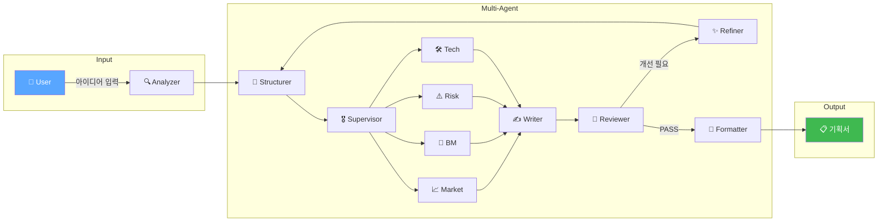
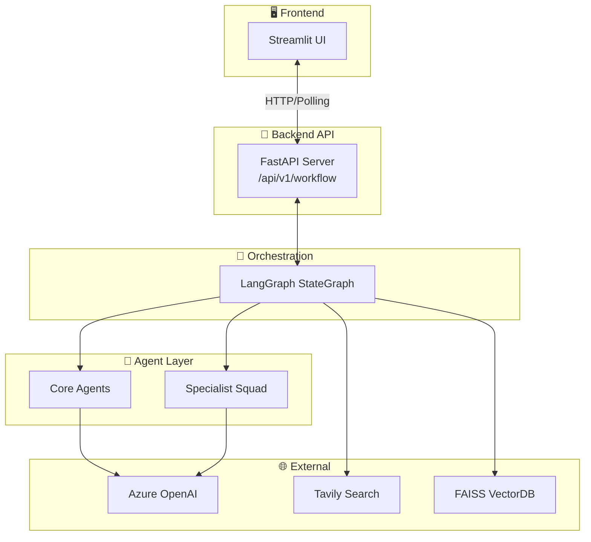

# 🚀 PlanCraft Agent

> **AI 기반 웹/앱 서비스 기획서 자동 생성 Multi-Agent 시스템**

[](https://langchain-ai.github.io/langgraph/)
[](https://fastapi.tiangolo.com/)
[](https://www.python.org/)
[](https://streamlit.io/)

### 🆕 최근 업데이트 (2026-01-07)

| 개선 항목 | 설명 |
|-----------|------|
| 🔄 **Writer ReAct 패턴** | Writer가 작성 중 자율적으로 도구 호출 (Thought→Action→Observation) |
| ⚡ **실시간 활동 로그** | 에이전트 작업 상태가 UI에 실시간으로 표시 |
| ⏱️ **정확한 실행 시간** | 각 단계별 소요 시간이 정확히 측정됨 |
| 🎯 **타겟 피드백** | Reviewer가 수정이 필요한 섹션을 구체적으로 지정 |

---

## 📋 목차

- [프로젝트 개요](#-프로젝트-개요)
- [핵심 기능](#-핵심-기능)
- [시스템 아키텍처](#-시스템-아키텍처)
- [빠른 시작](#-빠른-시작)
- [기술 스택](#-기술-스택)
- [프로젝트 구조](#-프로젝트-구조)
- [문서](#-문서)

---

## 🎯 프로젝트 개요

**PlanCraft Agent**는 사용자의 아이디어를 입력하면 **10개의 AI 에이전트**가 협업하여 **전문 수준의 기획서**를 자동으로 생성하는 시스템입니다.

> 📖 **상세 문서**: [PROJECT_REPORT.md](docs/PROJECT_REPORT.md) | [SYSTEM_DESIGN.md](docs/SYSTEM_DESIGN.md)

### 서비스 플로우



---

## ✨ 핵심 기능

### 1. 🧠 Plan-and-Execute Multi-Agent 아키텍처

**Supervisor**가 동적으로 계획을 수립하고, **Specialist Squad**가 병렬로 전문 분석을 수행합니다.

| Agent | 역할 | 출력 |
|-------|------|------|
| **🔍 Analyzer** | 사용자 요구사항 분석 | 토픽, 목표, 대상 사용자 |
| **📐 Structurer** | 기획서 목차 설계 | 9~10개 섹션 구조 |
| **🎖️ Supervisor** | Specialist 작업 계획 수립 | 분석 태스크 할당 |
| **📈 Market Agent** | TAM/SAM/SOM, 경쟁사 분석 | 시장 리서치 |
| **💼 BM Agent** | 수익 모델, 가격 정책, BEP | 비즈니스 모델 |
| **⚠️ Risk Agent** | 법적/기술적 리스크, SWOT | 리스크 분석 |
| **🛠️ Tech Agent** | 기술 스택, 아키텍처 설계 | 기술 명세 |
| **✍️ Writer** | 섹션별 콘텐츠 작성 (ReAct 패턴) | 기획서 초안 |
| **🔎 Reviewer** | 품질 평가 (PASS/REVISE/FAIL) | 점수, 피드백 |
| **✨ Refiner** | 피드백 기반 개선 | 개선 전략 |

### 2. 💬 Human-in-the-Loop (HITL)

LangGraph `interrupt()` 기반의 **사용자 개입 시스템**:

- **모호한 입력** 감지 시 옵션 선택 화면 제공
- **사용자 제약조건** 모든 에이전트에 전파
- **Time-Travel**: 과거 상태로 롤백 가능

### 3. 📚 RAG + Web Search 하이브리드

| 소스 | 역할 | 기술 |
|------|------|------|
| **RAG (내부)** | 기획서 작성 가이드라인 | FAISS + Multi-Query |
| **Web (외부)** | 실시간 시장 데이터 | Tavily API |

### 4. ⚡ 품질 프리셋

| 모드 | 속도 | 모델 | Writer ReAct | 용도 |
|------|------|------|--------------|------|
| **⚡ Fast** | ~1분 | GPT-4o-mini | ❌ | 아이디어 스케치 |
| **⚖️ Balanced** | 2~3분 | GPT-4o | ✅ | 일반 기획서 (기본값) |
| **💎 Quality** | 3~5분 | GPT-4o + 심층 분석 | ✅ | 투자 제안서 |

### 5. 🔄 품질 보증 루프 (QA Loop)

```
Writer → Reviewer → score ≥ 9 → Formatter (완료)
                  → score < 9 → Refiner → Structurer (개선, 최대 3회)
```

---

## 🏗️ 시스템 아키텍처



---

## 🚀 빠른 시작

### 1. 환경 설정

```bash
# 저장소 클론
git clone <repository-url>
cd plancraft-agent

# 가상환경 생성 및 활성화
python -m venv .venv
.venv\Scripts\activate  # Windows
# source .venv/bin/activate  # macOS/Linux

# 의존성 설치
pip install -r requirements.txt
```

### 2. 환경변수 설정

```bash
# .env 파일 생성
cp .env.example .env
```

`.env` 파일 편집:
```bash
# [필수] Azure OpenAI
AOAI_ENDPOINT=https://your-endpoint.openai.azure.com/
AOAI_API_KEY=your_api_key

# [선택] 웹 검색
TAVILY_API_KEY=your_tavily_key

# [선택] LangSmith 트레이싱
LANGCHAIN_TRACING_V2=true
LANGCHAIN_API_KEY=your_langsmith_key
```

### 3. 실행

```bash
streamlit run app.py
```

브라우저에서 **http://localhost:8501** 접속

---

## 🛠️ 기술 스택

| 분류 | 기술 |
|------|------|
| **LLM Orchestration** | LangGraph v0.5+, LangChain v0.2+ |
| **LLM** | Azure OpenAI (GPT-4o, GPT-4o-mini) |
| **Backend API** | FastAPI v0.115+ (REST API v1) |
| **Frontend** | Streamlit v1.35+ |
| **Vector DB** | FAISS (CPU) |
| **Web Search** | Tavily API |
| **Observability** | LangSmith, JSON Logging |
| **Testing** | pytest (308+ tests) |

---

## 📂 프로젝트 구조

```
plancraft-agent/
├── app.py                  # Streamlit 메인 앱
├── api/                    # FastAPI Backend
│   ├── main.py             # API 서버
│   ├── routers/            # REST 엔드포인트 (/api/v1/workflow)
│   ├── services/           # 비즈니스 로직
│   └── schemas/            # Pydantic 스키마
├── agents/                 # AI Agents
│   ├── analyzer.py         # 요구사항 분석
│   ├── structurer.py       # 목차 설계
│   ├── writer.py           # 콘텐츠 작성
│   ├── reviewer.py         # 품질 평가
│   ├── refiner.py          # 개선 수행
│   ├── formatter.py        # 최종 포맷팅
│   ├── supervisor.py       # Plan-and-Execute 오케스트레이터
│   └── specialists/        # 전문가 Squad
│       ├── market_agent.py # 시장 분석
│       ├── bm_agent.py     # 비즈니스 모델
│       ├── risk_agent.py   # 리스크 분석
│       ├── tech_agent.py   # 기술 설계
│       └── content_agent.py# 콘텐츠 전략
├── graph/                  # LangGraph Workflow
│   ├── workflow.py         # 메인 StateGraph
│   ├── state.py            # PlanCraftState 정의
│   ├── subgraphs.py        # Context/QA 서브그래프
│   └── interrupt_utils.py  # HITL 유틸리티
├── prompts/                # LLM 프롬프트
├── rag/                    # RAG Engine (FAISS)
├── tools/                  # Web Search (Tavily)
├── ui/                     # UI 컴포넌트
├── utils/                  # 유틸리티
├── tests/                  # pytest 테스트
└── docs/                   # 문서
```

---

## 📚 문서

| 문서 | 설명 |
|------|------|
| 📄 [**PROJECT_REPORT.md**](docs/PROJECT_REPORT.md) | 프로젝트 리포트 |
| 📐 [**SYSTEM_DESIGN.md**](docs/SYSTEM_DESIGN.md) | 시스템 아키텍처 설계서 |
| 🔀 [**MULTI_AGENT_DIAGRAM.md**](docs/MULTI_AGENT_DIAGRAM.md) | 멀티에이전트 구성도 (Mermaid) |
| 💬 [**HITL_GUIDE.md**](docs/HITL_GUIDE.md) | Human-in-the-Loop 가이드 |
| 📖 [USER_MANUAL.md](docs/USER_MANUAL.md) | 사용자 가이드 |
| 🛠️ [DEVELOPER_GUIDE.md](docs/DEVELOPER_GUIDE.md) | 개발자 가이드 |

---

## 📊 테스트

```bash
# 전체 테스트 실행
python -m pytest tests/ -v

# 커버리지 포함
python -m pytest tests/ --cov=. --cov-report=html
```

**현재 테스트 상태**: ✅ 308 passed, 6 failed (API 키 필요), 1 skipped

---

## 📝 License

MIT License

---

**Made with ❤️ using LangGraph + FastAPI + Streamlit**
