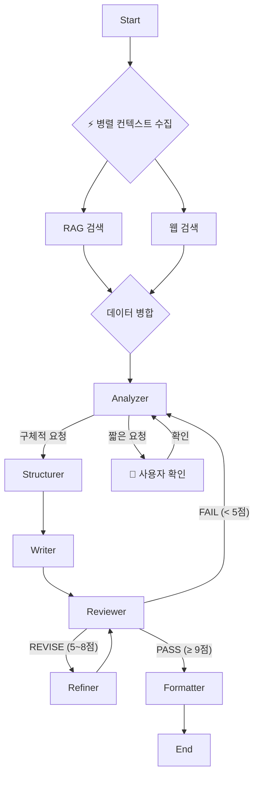

# 📋 PlanCraft Agent

> **AI 기반 웹/앱 서비스 기획서 자동 생성 Multi-Agent 시스템**

[](https://langchain-ai.github.io/langgraph/)
[](https://www.python.org/)
[](https://streamlit.io/)
[](./LICENSE)

---

## 🎯 핵심 기능

### 1. **진정한 멀티 에이전트 시스템**
6개의 전문 AI Agent가 협업하여 고품질 기획서를 생성합니다.

```
Analyzer → Structurer → Writer → Reviewer → Refiner → Formatter
```

### 2. **Human-in-the-Loop (HITL)**
- 🔄 **대화형 기획**: 짧은 요청 시 AI가 먼저 컨셉을 제안하고 확인을 받습니다
- 📝 **실시간 미리보기**: 제안된 컨셉(주제/목적/기능)을 확인 후 진행
- 💬 **자유 입력**: 버튼 선택 외에도 채팅으로 추가 요구사항 전달 가능

### 3. **동적 라우팅 & 지능형 에이전트**
- 🧠 **Writer의 자기 성찰 (Self-Correction)**: 섹션 누락이나 포맷 오류 시 LLM이 스스로 인지하고 자동 수정 (Reviewer 개입 최소화)
- 📊 **재무 계획 테이블 강제**: 줄글이 아닌 명확한 마크다운 테이블(Table)로 재무 계획 생성 보장
- 🚦 **Reviewer 기반 라우팅**:
  - < 5점 (FAIL): Analyzer 복귀
  - 5~8점 (REVISE): Refiner 실행 (최대 3회)
  - ≥ 9점 (PASS): Formatter 실행

### 4. **병렬 컨텍스트 수집**
RAG(문서 검색)와 Web Search를 **동시 실행**하여 응답 속도 30% 향상

### 5. **파일 기반 분석 (New)**
PDF, DOCX, TXT 파일을 업로드하면 내용을 자동으로 요약·분석하여 기획서에 반영합니다.

### 6. **운영 안정성**
- ✅ **Interrupt-First 설계**: LLM/API 호출 전 사이드 이펙트 없는 일시 중단(Pause) 보장
- ✅ **무한 루프 방지**: 최대 3회 재작성 제한 및 Fallback 처리
- ✅ **체크포인터**: Memory/PostgreSQL/Redis 지원 (Time-Travel 가능)
- ✅ **URL/Code Safe**: 정규식 후처리 부작용을 제거하여 링크/코드 블록 깨짐 원천 방지

---

## 🚀 빠른 시작

### 1. 환경 설정

```bash
# 저장소 클론
git clone https://github.com/your-repo/plancraft-agent.git
cd plancraft-agent

# 가상환경 생성
python -m venv .venv
source .venv/bin/activate  # Windows: .venv\Scripts\activate

# 의존성 설치
pip install -r requirements.txt
```

### 2. 환경변수 설정

```bash
# .env 파일 생성
cp .env.example .env

# .env 파일 편집 (API 키 입력)
```

**필수 환경변수:**
```env
# Azure OpenAI
AOAI_ENDPOINT=https://your-endpoint.openai.azure.com/
AOAI_API_KEY=your_api_key_here
AOAI_DEPLOY_GPT4O=gpt-4o

# (선택) LangSmith 트레이싱
LANGCHAIN_TRACING_V2=true
LANGCHAIN_API_KEY=your_langchain_api_key
```

### 3. 실행

```bash
streamlit run app.py
```

브라우저에서 `http://localhost:8501` 접속

---

## 🐳 Docker 배포

### 빌드 및 실행

```bash
# 이미지 빌드
docker build -t plancraft-agent .

# 컨테이너 실행 (환경변수 파일 사용)
docker run -d \
  --name plancraft \
  -p 8501:8501 \
  --env-file .env \
  plancraft-agent
```

### Docker Compose (권장)

```bash
docker-compose up -d
```

> ⚠️ **보안 주의**: `.env` 파일은 `.gitignore`에 포함되어 있어 Git에 커밋되지 않습니다.

---

## 🏗️ 시스템 아키텍처



---

## 📁 프로젝트 구조

```
plancraft-agent/
├── app.py                  # Streamlit 메인 앱
├── agents/                 # 6개 전문 Agent
│   ├── analyzer.py         # 입력 분석
│   ├── structurer.py       # 구조 설계
│   ├── writer.py           # 내용 작성
│   ├── reviewer.py         # 품질 검토
│   ├── refiner.py          # 개선 처리
│   └── formatter.py        # 최종 포맷팅
├── graph/                  # LangGraph 워크플로우
│   ├── workflow.py         # 메인 그래프
│   ├── state.py            # 상태 스키마
│   ├── subgraphs.py        # 서브그래프
│   └── interrupt_utils.py  # HITL 유틸리티
├── prompts/                # 에이전트 프롬프트
├── utils/                  # 유틸리티
│   ├── llm.py              # LLM 설정
│   ├── checkpointer.py     # 체크포인터 Factory
│   └── schemas.py          # Pydantic 스키마
├── ui/                     # Streamlit UI 컴포넌트
├── rag/                    # RAG 검색 시스템
├── tests/                  # 테스트 코드
├── docs/                   # 문서
├── Dockerfile              # Docker 이미지
├── docker-compose.yml      # Docker Compose
├── requirements.txt        # Python 의존성
└── .env.example            # 환경변수 템플릿
```

---

## 🧪 테스트

```bash
# 전체 테스트 실행
pytest

# 특정 테스트만 실행
pytest tests/test_scenarios.py -v
```

---

## 📚 관련 문서

- [아키텍처 설계](./docs/architecture.md)
- [배포 가이드](./docs/deployment-guide.md)
- [프로젝트 구조](./docs/PROJECT_STRUCTURE.md)
- [시스템 다이어그램](./docs/SYSTEM_DIAGRAM.md)

---

## 🔐 보안

- API 키는 `.env` 파일에만 저장
- `.env` 파일은 `.gitignore`에 포함되어 Git에 커밋되지 않음
- Docker 빌드 시 `--env-file` 옵션으로 환경변수 전달

---

## 🤝 기여

1. Fork the repository
2. Create your feature branch (`git checkout -b feature/amazing-feature`)
3. Commit your changes (`git commit -m 'Add amazing feature'`)
4. Push to the branch (`git push origin feature/amazing-feature`)
5. Open a Pull Request

---

## 📝 라이선스

MIT License - 자유롭게 사용, 수정, 배포 가능합니다.

---

**Made with ❤️ using LangGraph + Streamlit**
