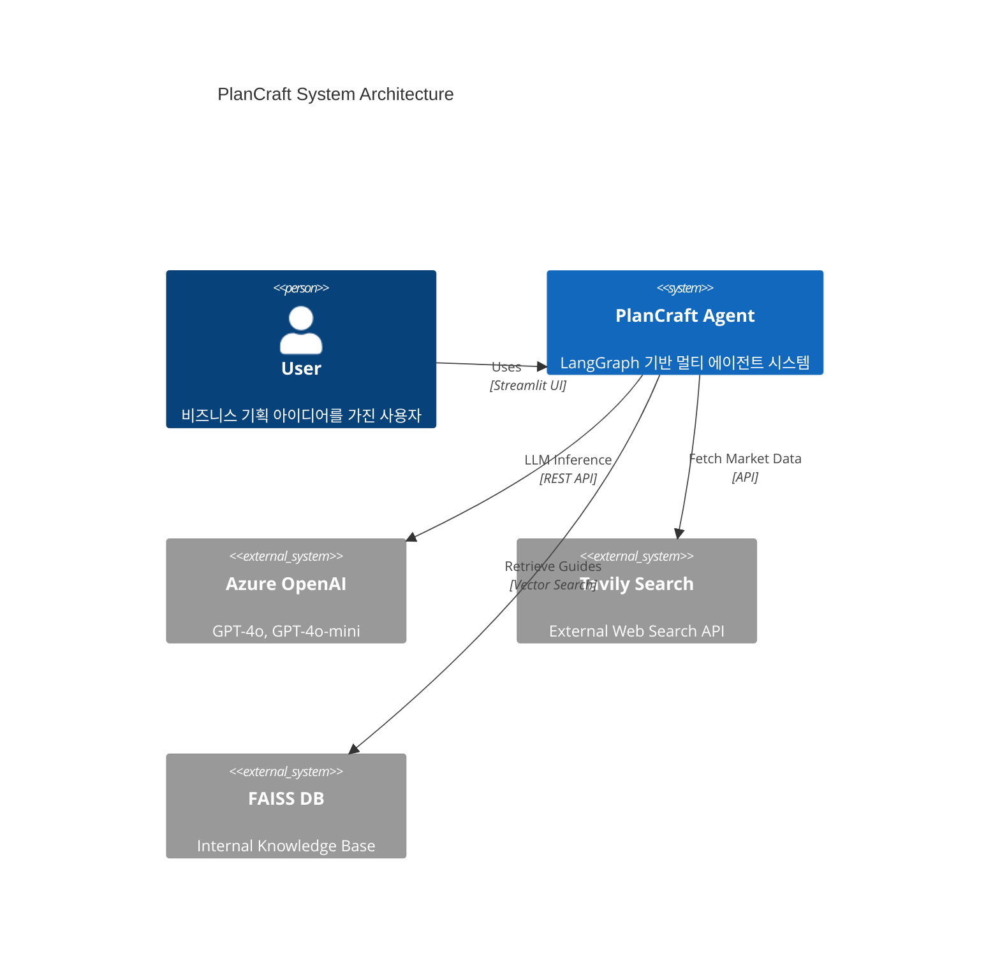
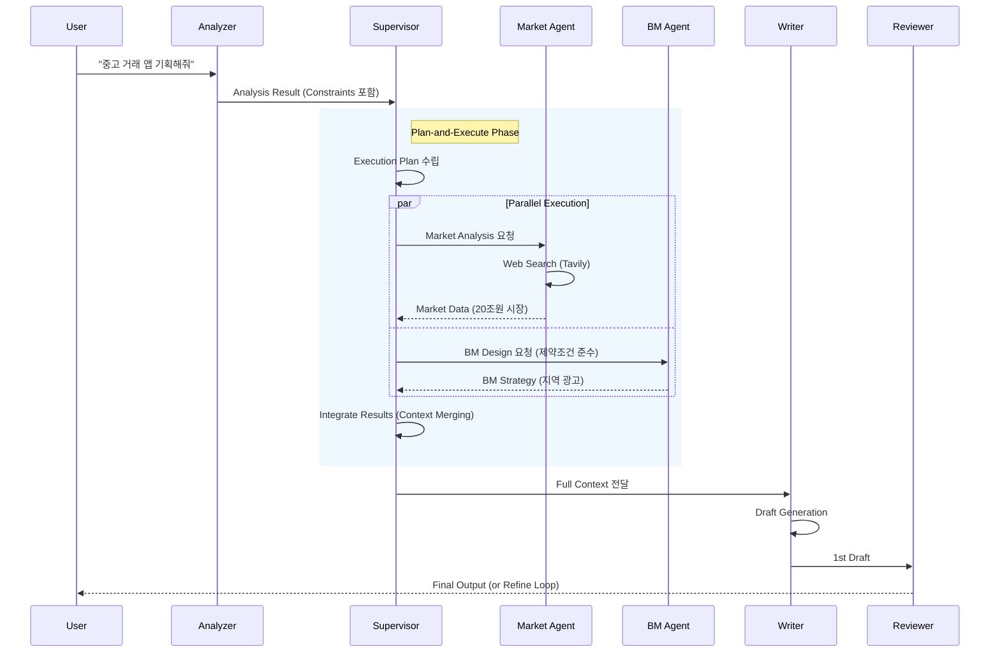
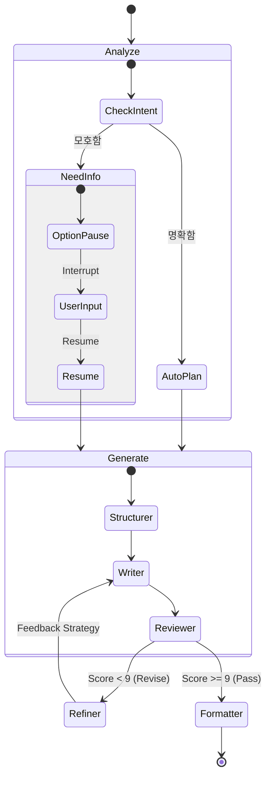
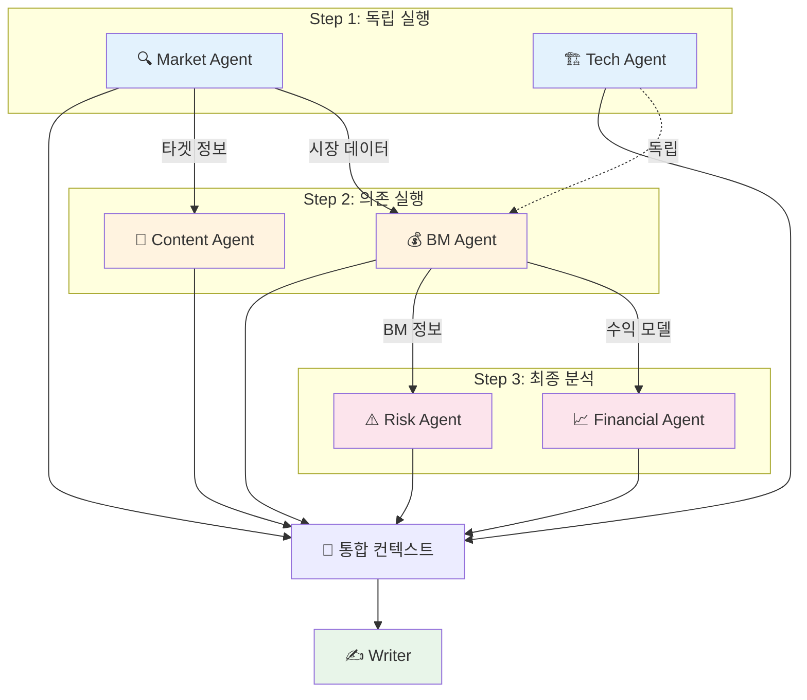
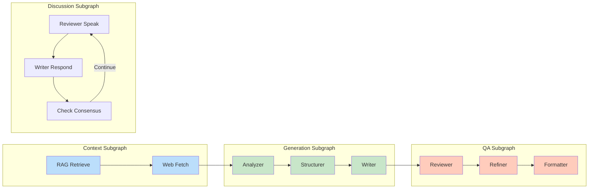

# 🏗️ PlanCraft System Design Document

**Version**: 2.1  
**Date**: 2026-01-01  
**Framework**: LangGraph, LangChain, Streamlit

---

## 1. 시스템 개요 (Overview)

PlanCraft는 사용자의 아이디어를 입력받아 전문적인 비즈니스 기획서(Business Plan)를 자동으로 생성하는 **Multi-Agent AI 시스템**입니다. 
LangGraph를 기반으로 구축되었으며, **Supervisor 패턴**과 **DAG(Directed Acyclic Graph) 실행 모델**을 결합하여 속도와 품질을 동시에 확보했습니다.

### 1.1 핵심 목표
- **전문성 (Expertise)**: 시장 분석, BM 설계, 재무 예측 등 각 분야별 전문 에이전트 협업.
- **상호작용 (Interactivity)**: Human-in-the-Loop(HITL)를 통해 모호한 요구사항을 구체화.
- **신뢰성 (Reliability)**: RAG(내부 데이터)와 Web Search(외부 데이터)를 교차 검증하여 환각(Hallucination) 최소화.

---

## 2. 시스템 아키텍처 (Architecture)

### 2.1 High-Level Architecture (C4 Container Style)



### 2.2 Core Workflow (Sequence Diagram)

Supervisor와 Specialist Agents가 어떻게 병렬로 협업하는지 보여주는 평행 실행(Parallel Execution) 시퀀스입니다.



### 2.3 HITL State Machine (Process Flow)

사용자 개입(Human-in-the-Loop)과 상태 전이를 보여주는 다이어그램입니다.



### 2.4 DAG-based Multi-Agent Execution (Supervisor Pattern)

6개의 Specialist Agent가 의존성 기반으로 병렬/순차 실행되는 흐름입니다.



### 2.5 Subgraph Architecture (Modular Design)

재사용 가능한 Subgraph 단위로 워크플로우를 분리하여 유지보수성을 극대화합니다.



### 2.6 Agent Interface Protocol (Standard Contract)

모든 Specialist Agent는 아래의 공통 인터페이스 규약을 준수해야 합니다. 이를 통해 미래의 Agent 추가 및 Tool 확장이 용이해집니다.

```python
# Protocol Definition
class SpecialistAgent(Protocol):
    def run(self, **kwargs) -> Dict[str, Any]:
        """
        에이전트 실행 진입점 (Stateless)
        
        Args:
            **kwargs: 실행 컨텍스트 (e.g., service_overview, target_users)
            
        Returns:
            Dict[str, Any]: 분석 결과 (반드시 JSON Serializable 해야 함)
            
        Raises:
            AgentExecutionError: 실행 실패 시 표준 예외 발생
        """
        ...
    
    def format_as_markdown(self, result: Dict[str, Any]) -> str:
        """결과를 마크다운 보고서 형식으로 변환"""
        ...
```

**표준 입출력 키 (Keys)**:
*   `user_constraints` (Input): 사용자의 하드 제약조건 (List[str])
*   `error` (Output): 실패 시 에러 메시지 (str)
*   `_meta` (Output): 실행 메타데이터 (latency, tokens 등)

---

## 3. 에이전트 상세 (Agent Roles)

총 10개의 전문 에이전트가 유기적으로 협업합니다.

| 분류 | 에이전트 | 역할 및 책임 | 핵심 기술 |
| :--- | :--- | :--- | :--- |
| **Control** | **Analyzer** | 사용자 의도 파악, 제약조건(Constraints) 추출, HITL 트리거 | Prompt Expansion |
| **Control** | **Supervisor** | 전문 에이전트 작업 계획 수립 및 DAG 스케줄링 | Plan-and-Execute |
| **Specialist** | **Market** | 시장 규모(TAM/SAM/SOM), 경쟁사 분석, 트렌드 조사 | Tavily Search |
| **Specialist** | **BM** | 수익 모델, 가격 정책, 가치 제안(Value Prop) 설계 | Business Frameworks |
| **Specialist** | **Financial** | 예상 매출, 손익분기점(BEP), 비용 구조 산출 | Python Calculation |
| **Specialist** | **Risk** | SWOT 분석 기반의 리스크 식별 및 완화 전략 수립 | Risk Matrix |
| **Worker** | **Structurer** | 기획서 목차 및 섹션별 가이드라인 설계 | Document Architecture |
| **Worker** | **Writer** | 9-Block 기획서 본문 작성, 시각화(Mermaid) 코드 생성 | Context Integration |
| **Quality** | **Reviewer** | 기획서 품질 평가(1-10점), 팩트 체크(Cross-Validation) | Scoring System |
| **Quality** | **Refiner** | 평가 피드백을 구체적인 수정 전략으로 변환 | Self-Correction |

---

## 4. 데이터 파이프라인 (Data Pipeline)

### 4.1 State Management (TypedDict)
LangGraph의 `State` 객체를 통해 에이전트 간 데이터를 공유합니다.

```python
class PlanCraftState(TypedDict):
    user_input: str
    analysis: AnalysisResult        # Analyzer 결과
    specialist_analysis: dict       # Supervisor 결과 (통합 리포트)
    draft: DraftResult              # Writer 결과 (기획서 초안)
    review: ReviewResult            # Reviewer 결과
    # ...
```

### 4.2 User Constraints Flow
사용자가 명시한 제약조건("광고 수익 필수")은 다음과 같이 흐릅니다.

1.  **Analyzer**: 텍스트에서 `user_constraints` 리스트 추출.
2.  **Supervisor**: `user_constraints`를 인자로 받아 전문 에이전트 컨텍스트에 주입.
3.  **Specailist Agents**: 각자 자신의 영역(BM, Tech)에서 제약조건을 최우선 반영.
4.  **Reviewer**: 최종 결과물이 제약조건을 준수했는지 검증.

---

## 5. 핵심 기술 (Key Technologies)

### 5.1 Human-in-the-Loop (HITL)
*   **Modular Interrupts**: `InterruptFactory`를 통해 Option, Form, Confirm 등 다양한 인터럽트 타입 지원.
*   **Timeout Handling**: 사용자 응답이 지연될 경우 자동 Timeout 처리 및 기본값 진행.
*   **Safety**: 인터럽트 전 Side-Effect 방지 원칙 준수.

### 5.2 RAG + Web Search Hybrid
*   **RAG**: FAISS 벡터 DB를 활용하여 기획 가이드, 사내 문서를 참조 (Format 준수).
*   **Web Search**: Tavily API를 사용하여 실시간 시장 데이터를 수집 (Fact 준수).

### 5.3 Quality Assurance
*   **Strict JSON Schema**: Pydantic을 사용하여 모든 에이전트의 출력을 검증.
*   **Dynamic Routing**: 품질 점수에 따라 `Complete`, `Refine`, `Restart` 경로 자동 분기.

---

## 6. 결론 (Conclusion)

PlanCraft는 단순한 텍스트 생성기가 아니라, **인간 기획자의 사고 과정(Thinking Process)**을 모방하고 **전문가의 지식(Specialty)**을 통합하는 고도화된 시스템입니다. Plan-and-Execute 아키텍처 도입으로 복잡한 비즈니스 문제 해결 능력을 획기적으로 향상시켰습니다.
