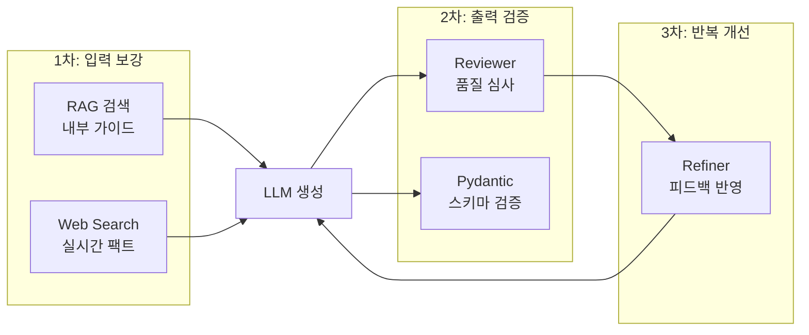
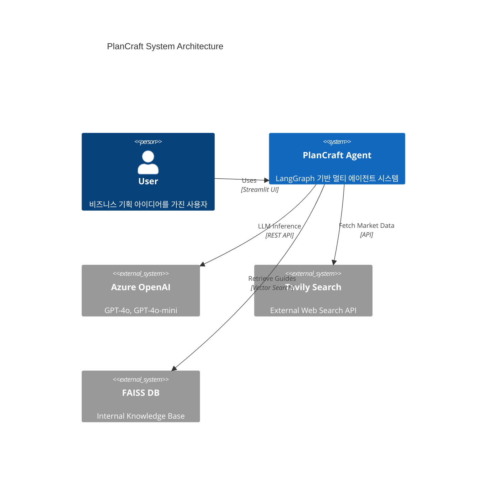
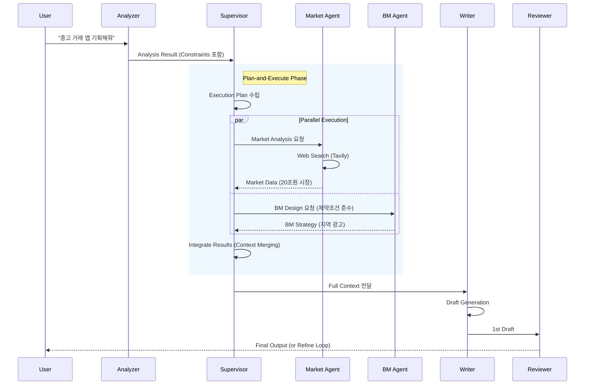
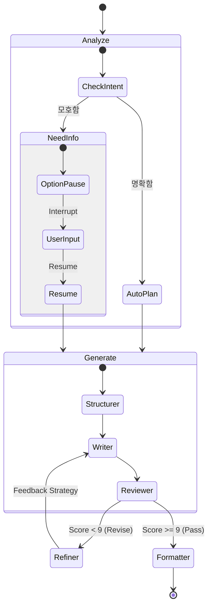
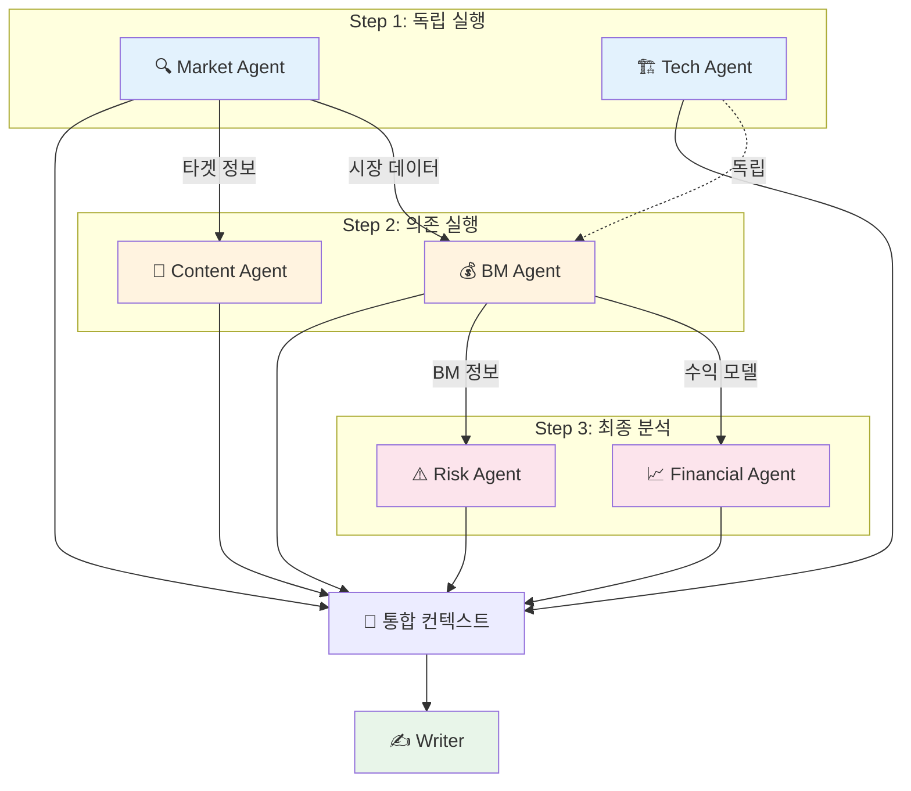
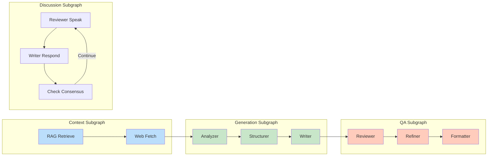
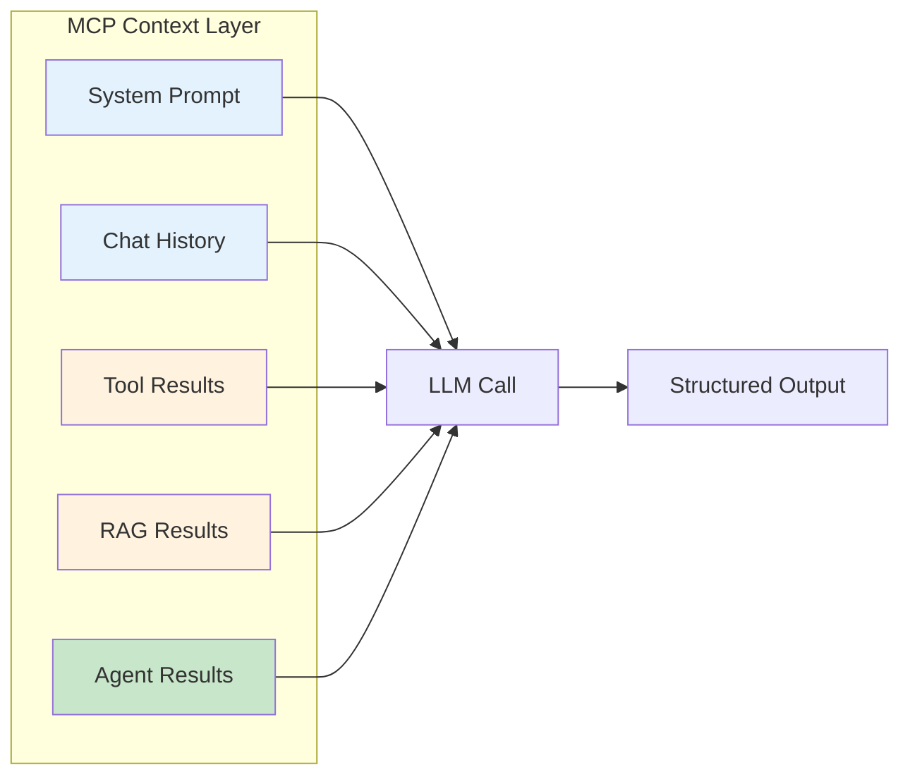
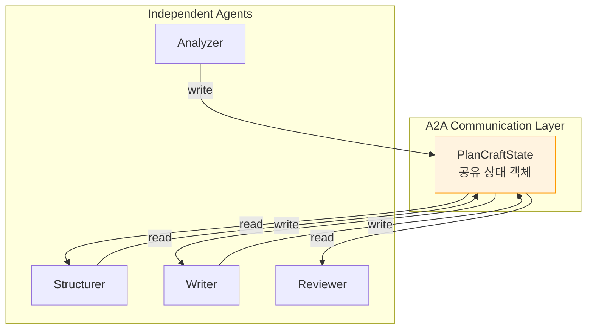

# 🏗️ PlanCraft System Design Document

**Version**: 2.5
**Date**: 2026-01-03
**Framework**: LangGraph, LangChain, Streamlit
**Standards**: MCP (Model Context Protocol), A2A (Agent-to-Agent)

---

## 1. 시스템 개요 (Overview)

PlanCraft는 사용자의 아이디어를 입력받아 전문적인 비즈니스 기획서(Business Plan)를 자동으로 생성하는 **Multi-Agent AI 시스템**입니다. 
LangGraph를 기반으로 구축되었으며, **Supervisor 패턴**과 **DAG(Directed Acyclic Graph) 실행 모델**을 결합하여 속도와 품질을 동시에 확보했습니다.

### 1.1 핵심 목표
- **전문성 (Expertise)**: 시장 분석, BM 설계, 재무 예측 등 각 분야별 전문 에이전트 협업.
- **상호작용 (Interactivity)**: Human-in-the-Loop(HITL)를 통해 모호한 요구사항을 구체화.
- **신뢰성 (Reliability)**: RAG(내부 데이터)와 Web Search(외부 데이터)를 교차 검증하여 환각(Hallucination) 최소화.

### 1.2 기술 선정 이유 (Technology Selection Rationale)

#### 1.2.1 Azure OpenAI 선택 이유

PlanCraft는 Public OpenAI API 대신 **Azure OpenAI Service**를 채택했습니다. 그 이유는 다음과 같습니다:

| 관점 | Public OpenAI | Azure OpenAI | PlanCraft 선택 |
|------|---------------|--------------|----------------|
| **데이터 보안** | 학습 데이터 활용 가능성 | 데이터 학습 Opt-out 보장 | ✅ Azure |
| **네트워크 통제** | Public Endpoint Only | VNet + Private Endpoint 지원 | ✅ Azure |
| **기업 감사** | 제한적 로깅 | Azure Monitor 통합 | ✅ Azure |
| **SLA** | Best Effort | 99.9% SLA 제공 | ✅ Azure |

```
📌 핵심 메시지
기업용 LLM 서비스는 "성능"보다 "통제 가능성"이 우선입니다.
Azure OpenAI는 동일한 GPT-4o 모델을 기업 보안 요구사항을 충족하며 사용할 수 있게 합니다.
```

**구현 위치**: `utils/config.py`, `utils/llm.py`
- 환경변수 기반 API Key 관리 (코드에 키 노출 없음)
- `.env.example` 템플릿 제공으로 안전한 설정 공유

#### 1.2.2 LangChain/LangGraph 사용 근거

PlanCraft는 LLM API를 직접 호출하는 대신 **LangChain 프레임워크**를 사용합니다.

**LangChain 선택 이유:**

| 장점 | 설명 | PlanCraft 활용 |
|------|------|----------------|
| **Provider 추상화** | OpenAI ↔ Azure 전환이 설정만으로 가능 | `AzureChatOpenAI` 사용 |
| **공통 인터페이스** | 모든 LLM을 동일한 `.invoke()` 방식으로 호출 | 에이전트별 일관된 호출 패턴 |
| **생태계 통합** | VectorStore, Memory, Tools 표준 컴포넌트 | FAISS, Retriever, @tool 데코레이터 |
| **Observability** | LangSmith 자동 트레이싱 | 디버깅 및 품질 모니터링 |

**LangGraph 선택 이유:**

기존 LangChain Agent의 한계를 극복하기 위해 LangGraph를 채택했습니다:

| LangChain Agent (Legacy) | LangGraph |
|--------------------------|-----------|
| 순차 실행만 지원 | 병렬/분기 실행 지원 |
| 상태 관리 어려움 | `StateGraph` 기반 명시적 상태 관리 |
| 디버깅 어려움 | 노드별 추적 및 Time Travel 가능 |
| HITL 구현 복잡 | `interrupt()` 네이티브 지원 |

```python
# LangGraph의 핵심 장점: 상태 기반 워크플로우
class PlanCraftState(TypedDict):
    user_input: str
    analysis: AnalysisResult
    draft: DraftResult
    review: ReviewResult
    # ... 모든 단계의 결과가 State로 관리됨

# Checkpoint 기반 복원: 장애 시 중단 지점부터 재개 가능
app = workflow.compile(checkpointer=PostgresSaver(pool))
```

```
📌 핵심 원칙
"프레임워크를 쓰기 전에, 반드시 LLM API 직접 사용을 이해해야 한다."
PlanCraft 팀은 OpenAI API 직접 호출을 먼저 학습한 후 LangChain으로 전환했습니다.
```

#### 1.2.3 LLM의 본질과 한계 이해

PlanCraft 설계의 출발점은 **LLM의 구조적 한계를 인정하는 것**입니다.

**LLM의 본질:**
```
📌 핵심 전제
LLM은 "지능"이 아니라 "확률 기반 다음 토큰 예측기"입니다.
"생각"하지 않고, "가장 그럴듯한 문장"을 생성합니다.
```

**LLM의 구조적 한계:**

| 한계 | 설명 | PlanCraft 대응 |
|------|------|----------------|
| **최신 정보 부재** | 학습 데이터 이후 정보 모름 | Web Search (Tavily) 연동 |
| **Hallucination** | 사실 검증 없이 그럴듯한 답변 생성 | RAG + 출력 검증 (Reviewer) |
| **계산/논리 오류** | 복잡한 연산에서 실수 가능 | 구조화된 프롬프트 + 자체 검증 |
| **Context Window 제한** | 긴 문서 전체 이해 불가 | Chunking (1000자, overlap 200) |
| **일관성 부족** | 같은 입력에 다른 출력 가능 | Structured Output + Pydantic 검증 |

**Hallucination 3중 방어 전략:**



| 방어 계층 | 전략 | 구현 위치 |
|----------|------|----------|
| **1차 (입력)** | RAG로 내부 가이드 제공 + Web Search로 실시간 팩트 주입 | `rag/retriever.py`, `tools/web_search.py` |
| **2차 (출력)** | Reviewer의 팩트 체크 + Pydantic 스키마 검증 | `agents/reviewer.py`, `with_structured_output()` |
| **3차 (반복)** | Refiner의 피드백 반영 후 재생성 | `agents/refiner.py`, `agents/writer.py` |

**LLM 단독 사용 vs RAG 비교:**

| 관점 | LLM 단독 | LLM + RAG (PlanCraft) |
|------|----------|----------------------|
| **정확성** | 환각 위험 높음 | 내부 문서 기반으로 환각 감소 |
| **최신성** | 학습 시점 데이터만 | Web Search로 실시간 보완 |
| **일관성** | 응답마다 다름 | 가이드라인 기반 일관된 형식 |
| **신뢰성** | 검증 불가 | 출처 표기 + 교차 검증 가능 |

```
📌 설계 원칙
LLM 단독 사용은 서비스에 위험합니다.
PlanCraft는 RAG + Web Search + 다단계 검증으로 "믿을 수 있는" 결과물을 생성합니다.
```

#### 1.2.4 Temperature 설정 전략

Temperature는 LLM 응답의 창의성/안정성을 조절하는 핵심 파라미터입니다.

| Temperature | 특성 | PlanCraft 적용 |
|-------------|------|----------------|
| **0.0~0.3** | 결정적, 일관된 응답 | Reviewer (0.1) - 엄격한 평가 필요 |
| **0.3~0.5** | 안정적, 약간의 변화 | Refiner (0.4) - 일관된 개선 전략 |
| **0.5~0.8** | 균형잡힌 창의성 | Writer (0.7) - 다양한 표현 |
| **0.8~1.0** | 높은 창의성, 불안정 | 사용 안함 - 기획서에 부적합 |

**프리셋별 Temperature 설정:**

| 프리셋 | Temperature | 이유 |
|--------|-------------|------|
| ⚡ 빠른 생성 | 0.3 | 일관된 결과로 빠른 완료 |
| ⚖️ 균형 | 0.7 | 창의성과 안정성 균형 |
| 💎 고품질 | 0.8 | 다양한 표현으로 풍부한 내용 |

---

## 2. 시스템 아키텍처 (Architecture)

### 2.1 High-Level Architecture (C4 Container Style)



### 2.2 Core Workflow (Sequence Diagram)

Supervisor와 Specialist Agents가 어떻게 병렬로 협업하는지 보여주는 평행 실행(Parallel Execution) 시퀀스입니다.



### 2.3 HITL State Machine (Process Flow)

사용자 개입(Human-in-the-Loop)과 상태 전이를 보여주는 다이어그램입니다.



### 2.4 DAG-based Multi-Agent Execution (Supervisor Pattern)

6개의 Specialist Agent가 의존성 기반으로 병렬/순차 실행되는 흐름입니다.



### 2.5 Subgraph Architecture (Modular Design)

재사용 가능한 Subgraph 단위로 워크플로우를 분리하여 유지보수성을 극대화합니다.



### 2.6 Agent Interface Protocol (Standard Contract)

모든 Specialist Agent는 아래의 공통 인터페이스 규약을 준수해야 합니다. 이를 통해 미래의 Agent 추가 및 Tool 확장이 용이해집니다.

```python
# Protocol Definition
class SpecialistAgent(Protocol):
    def run(self, **kwargs) -> Dict[str, Any]:
        """
        에이전트 실행 진입점 (Stateless)
        
        Args:
            **kwargs: 실행 컨텍스트 (e.g., service_overview, target_users)
            
        Returns:
            Dict[str, Any]: 분석 결과 (반드시 JSON Serializable 해야 함)
            
        Raises:
            AgentExecutionError: 실행 실패 시 표준 예외 발생
        """
        ...
    
    def format_as_markdown(self, result: Dict[str, Any]) -> str:
        """결과를 마크다운 보고서 형식으로 변환"""
        ...
```

**표준 입출력 키 (Keys)**:
*   `user_constraints` (Input): 사용자의 하드 제약조건 (List[str])
*   `error` (Output): 실패 시 에러 메시지 (str)
*   `_meta` (Output): 실행 메타데이터 (latency, tokens 등)

---

## 3. 에이전트 상세 (Agent Roles)

총 10개의 전문 에이전트가 유기적으로 협업합니다.

| 분류 | 에이전트 | 역할 및 책임 | 핵심 기술 |
| :--- | :--- | :--- | :--- |
| **Control** | **Analyzer** | 사용자 의도 파악, 제약조건(Constraints) 추출, HITL 트리거 | Prompt Expansion |
| **Control** | **Supervisor** | 전문 에이전트 작업 계획 수립 및 DAG 스케줄링 | Plan-and-Execute |
| **Specialist** | **Market** | 시장 규모(TAM/SAM/SOM), 경쟁사 분석, 트렌드 조사 | Tavily Search |
| **Specialist** | **BM** | 수익 모델, 가격 정책, 가치 제안(Value Prop) 설계 | Business Frameworks |
| **Specialist** | **Financial** | 예상 매출, 손익분기점(BEP), 비용 구조 산출 | Python Calculation |
| **Specialist** | **Risk** | SWOT 분석 기반의 리스크 식별 및 완화 전략 수립 | Risk Matrix |
| **Worker** | **Structurer** | 기획서 목차 및 섹션별 가이드라인 설계 | Document Architecture |
| **Worker** | **Writer** | 9-Block 기획서 본문 작성, 시각화(Mermaid) 코드 생성 | Context Integration |
| **Quality** | **Reviewer** | 기획서 품질 평가(1-10점), 팩트 체크(Cross-Validation) | Scoring System |
| **Quality** | **Refiner** | 평가 피드백을 구체적인 수정 전략으로 변환 | Self-Correction |

---

## 4. 데이터 파이프라인 (Data Pipeline)

### 4.1 State Management (TypedDict)
LangGraph의 `State` 객체를 통해 에이전트 간 데이터를 공유합니다.

```python
class PlanCraftState(TypedDict):
    user_input: str
    analysis: AnalysisResult        # Analyzer 결과
    specialist_analysis: dict       # Supervisor 결과 (통합 리포트)
    draft: DraftResult              # Writer 결과 (기획서 초안)
    review: ReviewResult            # Reviewer 결과
    # ...
```

### 4.2 User Constraints Flow
사용자가 명시한 제약조건("광고 수익 필수")은 다음과 같이 흐릅니다.

1.  **Analyzer**: 텍스트에서 `user_constraints` 리스트 추출.
2.  **Supervisor**: `user_constraints`를 인자로 받아 전문 에이전트 컨텍스트에 주입.
3.  **Specailist Agents**: 각자 자신의 영역(BM, Tech)에서 제약조건을 최우선 반영.
4.  **Reviewer**: 최종 결과물이 제약조건을 준수했는지 검증.

---

## 5. 핵심 기술 (Key Technologies)

### 5.1 Human-in-the-Loop (HITL)
*   **Modular Interrupts**: `InterruptFactory`를 통해 Option, Form, Confirm 등 다양한 인터럽트 타입 지원.
*   **Timeout Handling**: 사용자 응답이 지연될 경우 자동 Timeout 처리 및 기본값 진행.
*   **Safety**: 인터럽트 전 Side-Effect 방지 원칙 준수.

### 5.2 RAG + Web Search Hybrid
*   **RAG**: FAISS 벡터 DB를 활용하여 기획 가이드, 사내 문서를 참조 (Format 준수).
*   **Web Search**: Tavily API를 사용하여 실시간 시장 데이터를 수집 (Fact 준수).

### 5.3 Quality Assurance
*   **Strict JSON Schema**: Pydantic을 사용하여 모든 에이전트의 출력을 검증.
*   **Dynamic Routing**: 품질 점수에 따라 `Complete`, `Refine`, `Restart` 경로 자동 분기.

### 5.4 Prompt Engineering 전략

PlanCraft의 모든 프롬프트는 **설계 기술(Engineering)**로 관리됩니다. "요령"이 아닌 체계적인 설계 원칙을 적용합니다.

#### 5.4.1 프롬프트 구조화 원칙

모든 프롬프트는 **Role / Task / Context / Output** 4요소로 분리됩니다:

| 요소 | 목적 | 예시 (Analyzer) |
|------|------|----------------|
| **Role** | 페르소나 설정으로 응답 품질 향상 | "10년 경력의 시니어 기획 컨설턴트" |
| **Task** | 수행할 작업을 단계별로 명시 | "Step 1: 유형 판단 → Step 2: 컨셉 증폭" |
| **Context** | 배경 정보 및 참고 자료 제공 | RAG 결과, 웹 검색 결과, 이전 분석 결과 |
| **Output** | JSON 스키마로 출력 형식 고정 | `{ "topic": "", "need_more_info": false }` |

```
📌 왜 이렇게 설계했는가?
LLM은 확률 기반 생성기입니다. 명확한 구조 없이는 일관된 출력이 불가능합니다.
Role/Task/Output 분리로 "같은 입력 → 다른 답변" 문제를 해결합니다.
```

#### 5.4.2 프롬프트 패턴 적용

| 패턴 | 적용 에이전트 | 선택 이유 |
|------|--------------|----------|
| **Few-shot** | Analyzer | 입력 유형별 예시 3개로 분류 정확도 향상 |
| **Chain-of-Thought** | Writer, Reviewer | 복잡한 추론(섹션 작성, 품질 평가)에 단계별 사고 유도 |
| **Zero-shot** | Formatter | 단순 변환 작업은 예시 없이 직접 지시 |

```python
# Few-shot 예시 (analyzer_prompt.py)
### 예시 1: 잡담 ("안녕")
### 예시 2: 빈약한 요청 ("다이어트 앱") → 제안 모드
### 예시 3: 승인 ("좋아 진행해") → 확정 모드
```

#### 5.4.3 Structured Output 적용

모든 주요 에이전트는 **Pydantic + `with_structured_output()`** 조합으로 출력을 검증합니다:

```python
# 적용 예시 (agents/analyzer.py)
from pydantic import BaseModel

class AnalysisResult(BaseModel):
    topic: str
    purpose: str
    need_more_info: bool
    # ... 필드 정의

# LLM 호출 시 스키마 강제
llm.with_structured_output(AnalysisResult)
```

**적용 이유:**
- 후처리 비용 감소 (파싱 오류 제거)
- Agent/Workflow 연계 안정성 확보
- 타입 안전성으로 런타임 오류 방지

| 에이전트 | Output Schema | 핵심 필드 |
|---------|---------------|----------|
| Analyzer | `AnalysisResult` | topic, need_more_info, options |
| Structurer | `StructureResult` | sections, total_sections |
| Writer | `DraftResult` | sections[].content |
| Reviewer | `JudgeResult` | overall_score, verdict, action_items |

#### 5.4.4 Prompt Drift 방지 전략

반복 호출 시 지시가 무력화되는 "Prompt Drift" 문제를 다음과 같이 해결합니다:

| 전략 | 구현 방식 |
|------|----------|
| **System Prompt 고정** | 매 호출마다 동일한 System Prompt 주입 |
| **상태 최소화** | 필요한 Context만 전달 (전체 히스토리 X) |
| **출력 검증** | Pydantic으로 응답 구조 강제 검증 |
| **Self-Correction** | Writer의 자체 검증 루프로 품질 보장 |

#### 5.4.5 프롬프트 관리 원칙

```
prompts/
├── analyzer_prompt.py      # 요구사항 분석
├── structurer_prompt.py    # 구조 설계
├── writer_prompt.py        # 콘텐츠 작성
├── reviewer_prompt.py      # 품질 심사
├── refiner_prompt.py       # 개선 전략
├── discussion_prompt.py    # 에이전트 토론
├── formatter_prompt.py     # 최종 포맷팅
└── specialist_prompts/     # 전문 에이전트별
    ├── market_prompt.py
    ├── bm_prompt.py
    └── ...
```

**관리 원칙:**
- 프롬프트는 **코드처럼 버전 관리** (Git)
- 각 파일에 **목적과 사용법 주석** 포함
- **변경 시 테스트 필수** (동일 입력 반복 테스트)

---

## 6. MCP (Model Context Protocol) 적용

PlanCraft는 MCP(Model Context Protocol) 개념을 적용하여 LLM에 전달되는 Context를 체계적으로 관리합니다.

### 6.1 MCP Context 계층 구조

MCP는 LLM에 맥락(Context)을 전달하는 표준 프로토콜입니다. PlanCraft에서 각 Context 요소가 어떻게 매핑되는지 정리합니다.

| MCP Context 요소 | PlanCraft 구현 | 설명 |
|-----------------|----------------|------|
| **System Prompt** | `prompts/*.py` | 각 Agent별 역할 정의 프롬프트 (Writer, Reviewer 등) |
| **대화 히스토리** | `state.messages`, `state.chat_history` | 사용자-시스템 간 대화 기록 및 HITL 응답 |
| **Tool 호출 결과** | `state.web_context`, `state.web_sources` | Tavily Search, MCP Server 호출 결과 |
| **RAG 결과** | `state.rag_context` | FAISS Vector DB에서 검색한 가이드라인 문서 |
| **Agent 이전 단계 결과** | `state.analysis`, `state.structure`, `state.draft` | 이전 Agent의 출력이 다음 Agent의 입력으로 전달 |



### 6.2 MCP 구성요소 매핑

MCP의 Host/Client/Server 개념이 PlanCraft 시스템에서 어떻게 구현되는지 매핑합니다.

| MCP 개념 | PlanCraft 구현체 | 역할 |
|----------|-----------------|------|
| **MCP Host** | `app.py` (Streamlit) | 사용자 인터페이스, 워크플로우 실행 요청 |
| **MCP Client** | `MCPToolkit` (`tools/mcp_client.py`) | MCP 서버 연결 관리, 도구 호출 추상화 |
| **MCP Server** | `mcp-server-fetch`, `tavily-mcp` | 외부 리소스 접근 (URL Fetch, Web Search) |

```
┌─────────────────────────────────────────────────────────────────┐
│                        MCP Host (Streamlit)                      │
│  ┌─────────────────────────────────────────────────────────┐    │
│  │                    LangGraph Workflow                    │    │
│  │  ┌─────────────┐    ┌─────────────┐    ┌─────────────┐  │    │
│  │  │   Analyzer  │ -> │   Writer    │ -> │  Reviewer   │  │    │
│  │  └─────────────┘    └─────────────┘    └─────────────┘  │    │
│  └─────────────────────────────────────────────────────────┘    │
│                              │                                   │
│                              ▼                                   │
│  ┌─────────────────────────────────────────────────────────┐    │
│  │                  MCP Client (MCPToolkit)                 │    │
│  └─────────────────────────────────────────────────────────┘    │
└─────────────────────────────────────────────────────────────────┘
                               │
           ┌───────────────────┼───────────────────┐
           ▼                   ▼                   ▼
    ┌─────────────┐     ┌─────────────┐     ┌─────────────┐
    │ MCP Server  │     │ MCP Server  │     │   Fallback  │
    │   (Fetch)   │     │  (Tavily)   │     │ (Python SDK)│
    └─────────────┘     └─────────────┘     └─────────────┘
```

### 6.3 Context 수집 파이프라인

```python
# Context 수집 순서 (graph/nodes.py)
def collect_context(state: PlanCraftState) -> PlanCraftState:
    # 1. RAG Context (내부 가이드라인)
    rag_context = vectorstore.similarity_search(state["user_input"])

    # 2. Web Context (외부 시장 데이터) - MCP Server 호출
    web_context = mcp_toolkit.search(query)

    # 3. Previous Agent Results (이전 단계 결과)
    previous_results = {
        "analysis": state.get("analysis"),
        "structure": state.get("structure"),
    }

    # 4. 통합 Context 구성
    return {
        "rag_context": rag_context,
        "web_context": web_context,
        "agent_context": previous_results
    }
```

---

## 7. A2A (Agent-to-Agent) 설계

PlanCraft는 A2A(Agent-to-Agent) 통신 표준을 적용하여 에이전트 간 협업을 설계했습니다.

### 7.1 A2A 설계 3원칙

| 원칙 | 설명 | PlanCraft 구현 |
|------|------|----------------|
| **독립성 (Independence)** | 각 Agent는 다른 Agent의 내부 구현을 알 필요 없이 표준 인터페이스만으로 협업 | `PlanCraftState` TypedDict를 통한 데이터 교환 |
| **상호운용성 (Interoperability)** | 모든 Agent는 공통 State를 통해 데이터를 주고받으며, 직접 호출하지 않음 | LangGraph StateGraph가 라우팅 담당 |
| **확장성 (Extensibility)** | 새로운 Agent는 `run()` 인터페이스만 구현하면 즉시 등록 가능 | Supervisor가 동적으로 Agent 목록 관리 |



### 7.2 Agent Capability 명세 (Agent Card)

각 에이전트의 역량(Capability)을 표준화된 Agent Card 형식으로 정의합니다.

#### Control Agents

```yaml
# Agent Card: Analyzer
name: Analyzer
type: Control
capability:
  - 사용자 입력 분석 및 의도 파악
  - 핵심 정보 추출 (topic, goal, target_audience)
  - 모호한 입력 감지 및 HITL 인터럽트 트리거
input:
  - user_input: str
  - rag_context: str (optional)
  - web_context: str (optional)
output:
  - AnalysisResult: {topic, goal, target_audience, constraints, need_more_info}
dependencies: []
triggers: [HITL Interrupt if need_more_info=True]
```

```yaml
# Agent Card: Supervisor
name: Supervisor
type: Control
capability:
  - 6개 Specialist Agent 병렬 실행 조율
  - DAG 기반 의존성 스케줄링
  - 결과 통합 및 Context Merging
input:
  - analysis: AnalysisResult
  - rag_context: str
  - web_context: str
output:
  - specialist_analysis: {market, business_model, financial, risk, tech, content}
dependencies: [Analyzer]
```

#### Specialist Agents

```yaml
# Agent Card: Market Agent
name: Market
type: Specialist
capability:
  - TAM/SAM/SOM 시장 규모 분석
  - 경쟁사 분석 및 차별화 포인트 도출
  - 시장 트렌드 조사
input:
  - service_overview: str
  - target_users: str
  - web_context: str
output:
  - MarketAnalysis: {tam, sam, som, competitors, trends}
dependencies: []
tools: [Tavily Search]
```

```yaml
# Agent Card: BM Agent
name: BusinessModel
type: Specialist
capability:
  - 수익 모델 설계 (광고, 구독, 거래수수료 등)
  - 가격 정책 수립
  - 가치 제안(Value Proposition) 정의
input:
  - service_overview: str
  - market_analysis: MarketAnalysis (optional)
  - user_constraints: List[str]
output:
  - BusinessModelAnalysis: {revenue_model, pricing, value_proposition}
dependencies: [Market (optional)]
```

```yaml
# Agent Card: Financial Agent
name: Financial
type: Specialist
capability:
  - 예상 매출 및 비용 구조 산출
  - 손익분기점(BEP) 분석
  - 투자 회수 기간 예측
input:
  - business_model: BusinessModelAnalysis
  - market_analysis: MarketAnalysis
output:
  - FinancialPlan: {revenue_projection, cost_structure, bep_analysis}
dependencies: [Market, BusinessModel]
```

```yaml
# Agent Card: Risk Agent
name: Risk
type: Specialist
capability:
  - SWOT 분석 수행
  - 리스크 식별 및 영향도 평가
  - 완화 전략 수립
input:
  - business_model: BusinessModelAnalysis
  - market_analysis: MarketAnalysis
output:
  - RiskAnalysis: {swot, risks, mitigation_strategies}
dependencies: [Market, BusinessModel]
```

#### Worker Agents

```yaml
# Agent Card: Writer
name: Writer
type: Worker
capability:
  - 9-Block 기획서 본문 작성
  - Mermaid 다이어그램 생성
  - 자체 품질 검증 (Self-Reflection)
input:
  - structure: StructureResult
  - rag_context: str
  - specialist_analysis: dict
  - refinement_guideline: dict (optional)
output:
  - DraftResult: {sections: List[SectionContent], total_word_count: int}
dependencies: [Structurer, Supervisor]
```

#### Quality Agents

```yaml
# Agent Card: Reviewer
name: Reviewer
type: Quality
capability:
  - 기획서 품질 평가 (1-10점 스코어링)
  - 팩트 체크 (Cross-Validation)
  - 개선 피드백 생성
input:
  - draft: DraftResult
  - analysis: AnalysisResult
  - structure: StructureResult
output:
  - ReviewResult: {overall_score, verdict, feedback, action_items}
dependencies: [Writer]
routing:
  - score >= 9: COMPLETE -> Formatter
  - score < 5: RESTART -> Analyzer
  - 5 <= score < 9: REFINE -> Refiner
```

### 7.3 Agent 간 통신 프로토콜

```python
# A2A 통신 규약 (State 기반)
class AgentCommunicationProtocol:
    """
    모든 Agent는 이 프로토콜을 준수해야 합니다.

    1. 입력: state dict에서 필요한 키만 읽음 (다른 Agent 직접 호출 금지)
    2. 출력: 자신의 결과를 state에 기록 (표준 키 사용)
    3. 에러: 표준 에러 형식으로 state.error에 기록
    """

    # 표준 입출력 키
    STANDARD_KEYS = {
        "analyzer": {"in": ["user_input"], "out": ["analysis"]},
        "structurer": {"in": ["analysis"], "out": ["structure"]},
        "writer": {"in": ["structure", "rag_context"], "out": ["draft"]},
        "reviewer": {"in": ["draft"], "out": ["review"]},
        "refiner": {"in": ["review", "draft"], "out": ["refinement_guideline"]},
    }
```

---

## 8. 결론 (Conclusion)

PlanCraft는 단순한 텍스트 생성기가 아니라, **인간 기획자의 사고 과정(Thinking Process)**을 모방하고 **전문가의 지식(Specialty)**을 통합하는 고도화된 시스템입니다. Plan-and-Execute 아키텍처 도입으로 복잡한 비즈니스 문제 해결 능력을 획기적으로 향상시켰습니다.
