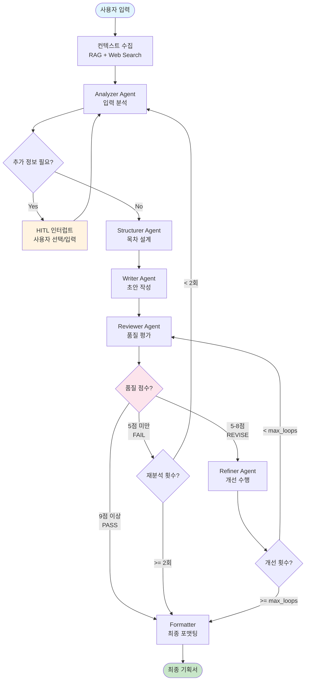
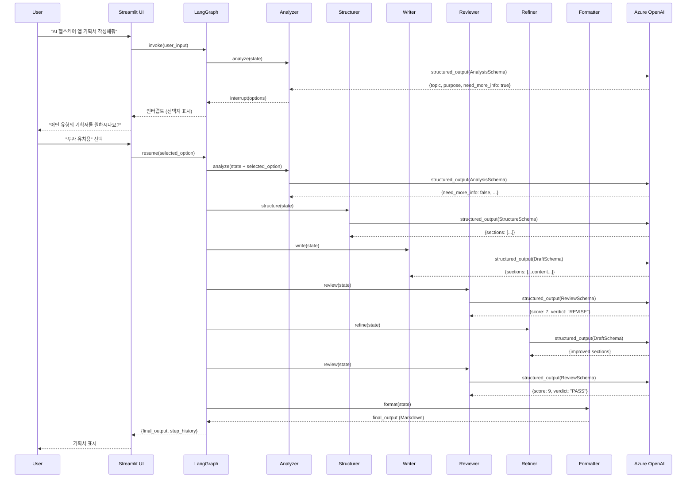

# 📋 PlanCraft 기획서 생성 워크플로우 가이드

**Version**: 2.1
**Date**: 2026-01-01
**Purpose**: 사용자 입력부터 최종 기획서 생성까지의 전체 흐름 설명

---

## 1. 개요 (Overview)

이 문서는 사용자가 "기획서 작성해줘"라고 요청했을 때, PlanCraft가 어떻게 동작하여 최종 기획서를 생성하는지 상세하게 설명합니다.

### 1.1 전체 흐름 요약

```
사용자 입력 → 분석 → [HITL 인터럽트] → 구조화 → 초안 작성 → 품질 평가 → [개선 루프] → 포맷팅 → 최종 출력
```

### 1.2 핵심 특징

| 특징 | 설명 |
|------|------|
| **Multi-Agent** | 7개 전문 에이전트가 역할 분담하여 협업 |
| **HITL** | Human-in-the-Loop으로 모호한 입력 구체화 |
| **Quality Loop** | Reviewer-Refiner 피드백 루프로 품질 보장 |
| **Graceful Degradation** | 에러 발생 시에도 중간 결과물 제공 |

---

## 2. 워크플로우 상세 (Detailed Workflow)

### 2.1 전체 플로우 다이어그램



### 2.2 단계별 설명

#### Step 1: 컨텍스트 수집 (Context Collection)

```python
# graph/workflow.py - context_collector 노드
def context_collector(state: PlanCraftState) -> PlanCraftState:
    """RAG + Web Search로 참조 자료 수집"""
```

| 소스 | 목적 | 도구 |
|------|------|------|
| **RAG** | 내부 기획서 가이드라인, 템플릿 참조 | FAISS Vector DB |
| **Web Search** | 시장 동향, 경쟁사 정보 수집 | Tavily API |

**LLM 호출**: 없음 (벡터 검색 + API 호출만)

---

#### Step 2: Analyzer Agent (입력 분석)

```python
# agents/analyzer.py
def analyzer_agent(state: PlanCraftState) -> PlanCraftState:
    """사용자 입력을 분석하여 기획 요소 추출"""
```

**역할**:
- 사용자 입력에서 핵심 정보 추출 (주제, 목적, 대상 등)
- 누락된 정보 식별
- HITL 인터럽트 필요 여부 판단

**출력 스키마** (`AnalysisOutput`):
```python
{
    "topic": "AI 기반 헬스케어 앱",
    "purpose": "투자 유치용 사업계획서",
    "target_audience": "벤처 캐피탈",
    "key_requirements": ["시장 분석", "수익 모델", "경쟁 우위"],
    "need_more_info": True,  # HITL 트리거
    "options": [...]         # 선택지 제공
}
```

**LLM 호출**: 1회 (GPT-4o-mini, structured output)

---

#### Step 3: HITL 인터럽트 (Human-in-the-Loop)

```python
# graph/interrupt_utils.py
def make_pause_node(interrupt_type: str) -> Callable:
    """인터럽트 노드 생성 팩토리"""
```

**트리거 조건**:
- `need_more_info == True`
- 입력 길이 < 20자 (Fast Track 미충족)
- 모호한 요구사항 감지

**인터럽트 유형**:

| 타입 | 설명 | UI 표시 |
|------|------|---------|
| `option` | 선택지 제시 (예: 기획서 유형 선택) | 버튼 그룹 |
| `form` | 추가 정보 입력 요청 | 입력 폼 |
| `confirm` | 진행 여부 확인 | 확인/취소 |
| `approval` | 중간 결과물 승인 요청 | 승인 버튼 |

**Flow**:
```
Analyzer → need_more_info=True → interrupt() 호출 → UI에서 대기 →
사용자 응답 → Command.resume(response) → Analyzer 재실행
```

**LLM 호출**: 없음 (UI 대기)

---

#### Step 4: Structurer Agent (목차 설계)

```python
# agents/structurer.py
def structurer_agent(state: PlanCraftState) -> PlanCraftState:
    """기획서 목차 및 섹션 구조 설계"""
```

**역할**:
- 분석 결과를 바탕으로 목차 생성
- 프리셋에 따른 최소 섹션 수 보장 (fast: 7개, balanced: 9개, quality: 10개)
- 자체 검증 (Self-Correction) 루프

**출력 스키마** (`StructureOutput`):
```python
{
    "sections": [
        {"title": "1. 시장 분석", "purpose": "TAM/SAM/SOM 분석", "key_points": [...]},
        {"title": "2. 문제 정의", "purpose": "해결하려는 페인포인트", "key_points": [...]},
        # ... 최소 7~10개 섹션
    ],
    "total_sections": 9
}
```

**LLM 호출**: 1~3회 (검증 실패 시 재시도, max=`structurer_max_retries`)

---

#### Step 5: Writer Agent (초안 작성)

```python
# agents/writer.py
def writer_agent(state: PlanCraftState) -> PlanCraftState:
    """섹션별 상세 내용 작성"""
```

**역할**:
- Structurer가 설계한 목차에 따라 각 섹션 본문 작성
- RAG/Web 컨텍스트 활용하여 구체적 데이터 포함
- 자체 검증 (Self-Correction) 루프

**출력 스키마** (`DraftOutput`):
```python
{
    "sections": [
        {
            "title": "1. 시장 분석",
            "content": "## 1. 시장 분석\n\n### 1.1 TAM (Total Addressable Market)\n...",
            "word_count": 450
        },
        # ... 각 섹션
    ],
    "total_word_count": 3500
}
```

**LLM 호출**: 1~3회 (검증 실패 시 재시도, max=`writer_max_retries`)

---

#### Step 6: Reviewer Agent (품질 평가)

```python
# agents/reviewer.py
def reviewer_agent(state: PlanCraftState) -> PlanCraftState:
    """초안/개선본 품질 평가 및 피드백"""
```

**역할**:
- 10점 만점 기준 품질 점수 산출
- 항목별 상세 피드백 제공
- 라우팅 결정 (PASS/REVISE/FAIL)

**평가 기준**:

| 항목 | 배점 | 설명 |
|------|------|------|
| 완성도 | 2점 | 모든 섹션이 적절히 작성되었는가 |
| 논리성 | 2점 | 논리적 흐름과 일관성 |
| 구체성 | 2점 | 데이터와 근거의 구체성 |
| 실행 가능성 | 2점 | 실현 가능한 계획인가 |
| 가독성 | 2점 | 문서 구조와 표현의 명확성 |

**출력 스키마** (`ReviewOutput`):
```python
{
    "score": 7,
    "verdict": "REVISE",
    "feedback": {
        "strengths": ["시장 분석이 체계적", "..."],
        "weaknesses": ["재무 예측 근거 부족", "..."],
        "action_items": ["3년 재무 추정 추가", "경쟁사 비교표 보완"]
    }
}
```

**LLM 호출**: 1회

---

#### Step 7: 품질 기반 라우팅 (Quality Routing)

```python
# graph/workflow.py - should_refine_or_restart()
def should_refine_or_restart(state: PlanCraftState) -> Literal["refine", "restart", "format"]:
```

**라우팅 로직**:

```python
from utils.settings import QualityThresholds

score = state["review"]["score"]
verdict = state["review"]["verdict"]

# 1. PASS 조건: 9점 이상 + PASS 판정
if QualityThresholds.is_pass(score) and verdict == "PASS":
    return "format"  # → Formatter로

# 2. FAIL 조건: 5점 미만 + 재시작 횟수 여유
if QualityThresholds.is_fail(score):
    if state["restart_count"] < max_restart_count:
        return "restart"  # → Analyzer로 복귀
    return "format"  # 재시작 한도 초과, 강제 종료

# 3. REVISE 조건: 5~8점
if state["refine_count"] < max_refine_loops:
    return "refine"  # → Refiner로
return "format"  # 개선 한도 초과, 강제 종료
```

**점수 임계값** (`QualityThresholds`):

| 임계값 | 값 | 설명 |
|--------|---|------|
| `SCORE_PASS` | 9 | 이상이면 통과 |
| `SCORE_FAIL` | 5 | 미만이면 재분석 |
| `MAX_RESTART_COUNT` | 2 | 최대 재분석 횟수 |
| `MAX_REFINE_LOOPS` | 3 | 최대 개선 루프 |

---

#### Step 8: Refiner Agent (개선 수행)

```python
# agents/refiner.py
def refiner_agent(state: PlanCraftState) -> PlanCraftState:
    """Reviewer 피드백 기반 개선"""
```

**역할**:
- Reviewer의 `action_items` 반영
- 약점(weaknesses) 보완
- 개선된 초안 생성

**입력**:
- 현재 초안 (`state["draft"]`)
- 리뷰 피드백 (`state["review"]["feedback"]`)
- 원본 분석 (`state["analysis"]`)

**출력**: 개선된 `DraftOutput`

**LLM 호출**: 1회

---

#### Step 9: Formatter (최종 포맷팅)

```python
# graph/workflow.py - formatter 노드
def formatter(state: PlanCraftState) -> PlanCraftState:
    """최종 마크다운 문서 생성"""
```

**역할**:
- 모든 섹션을 하나의 마크다운 문서로 조합
- 목차, 헤더, 푸터 추가
- 메타데이터 포함 (생성 일시, 버전 등)

**LLM 호출**: 없음 (템플릿 기반 조합)

---

## 3. LLM 호출 요약 (LLM Call Summary)

### 3.1 호출 횟수 분석

| 에이전트 | 최소 | 최대 | 모델 | 비고 |
|----------|------|------|------|------|
| Analyzer | 1 | 1 | gpt-4o-mini | 입력 분석 |
| Structurer | 1 | 3 | gpt-4o-mini | 자체 검증 |
| Writer | 1 | 3 | gpt-4o-mini | 자체 검증 |
| Reviewer | 1 | 3+ | gpt-4o-mini | 루프당 1회 |
| Refiner | 0 | 3 | gpt-4o-mini | 개선 시에만 |
| **합계** | **4** | **13+** | | |

### 3.2 프리셋별 예상 호출

| 프리셋 | Temperature | Max Loops | 예상 LLM 호출 |
|--------|-------------|-----------|---------------|
| Fast | 0.3 | 1 | 4~6회 |
| Balanced | 0.7 | 2 | 5~9회 |
| Quality | 1.0 | 3 | 6~13회 |

---

## 4. 상태 관리 (State Management)

### 4.1 PlanCraftState 주요 필드

```python
class PlanCraftState(TypedDict, total=False):
    # === 입력 ===
    user_input: str           # 사용자 원본 입력
    file_content: str         # 업로드 파일 내용
    generation_preset: str    # fast/balanced/quality

    # === 에이전트 출력 ===
    analysis: dict            # Analyzer 결과
    structure: dict           # Structurer 결과
    draft: dict               # Writer/Refiner 결과
    review: dict              # Reviewer 결과

    # === 제어 ===
    refine_count: int         # 현재 개선 루프 횟수
    restart_count: int        # Analyzer 복귀 횟수

    # === HITL ===
    need_more_info: bool      # 인터럽트 필요 여부
    options: List[dict]       # 선택지 목록
    selected_option: str      # 사용자 선택

    # === 출력 ===
    final_output: str         # 최종 기획서
    step_history: List[dict]  # 실행 이력
```

### 4.2 불변성 보장

```python
from graph.state import update_state

# 상태 업데이트 시 항상 새 객체 생성
new_state = update_state(state,
    refine_count=state["refine_count"] + 1,
    draft=new_draft
)
```

---

## 5. 에러 처리 (Error Handling)

### 5.1 에러 카테고리

| 카테고리 | 예시 | 처리 방식 |
|----------|------|-----------|
| `LLM_ERROR` | API 타임아웃, 토큰 초과 | 재시도 or 폴백 |
| `NETWORK_ERROR` | Web Search 실패 | RAG만으로 진행 |
| `VALIDATION_ERROR` | 출력 파싱 실패 | 기본값 사용 |
| `STATE_ERROR` | 상태 불일치 | 에러 기록 후 진행 |

### 5.2 Graceful Degradation

```python
@handle_node_error
def writer_agent(state: PlanCraftState) -> PlanCraftState:
    """에러 발생 시 step_status="FAILED"로 설정되고 다음 단계로 진행"""
```

---

## 6. 시퀀스 다이어그램 (Sequence Diagram)



---

## 7. 프리셋 상세 (Generation Presets)

### 7.1 프리셋 비교표

| 설정 | Fast | Balanced | Quality |
|------|------|----------|---------|
| **Temperature** | 0.3 | 0.7 | 1.0 |
| **Max Refine Loops** | 1 | 2 | 3 |
| **Max Restart** | 1 | 2 | 2 |
| **Writer Retries** | 1 | 2 | 3 |
| **Min Sections** | 7 | 9 | 10 |
| **Discussion** | Off | On | On |
| **Diagrams** | 0 | 1 | 1 |
| **Charts** | 0 | 1 | 2 |

### 7.2 프리셋 선택 가이드

- **Fast**: 빠른 초안이 필요할 때, 아이디어 검증 단계
- **Balanced**: 일반적인 기획서 작성 (권장)
- **Quality**: 중요한 프레젠테이션, 투자 유치용

---

## 8. 관련 문서

- [SYSTEM_DESIGN.md](./SYSTEM_DESIGN.md) - 시스템 아키텍처 상세
- [HITL_GUIDE.md](./HITL_GUIDE.md) - Human-in-the-Loop 패턴 가이드
- [DEVELOPER_GUIDE.md](./DEVELOPER_GUIDE.md) - 개발자 가이드

---

*Generated by PlanCraft Documentation System*
