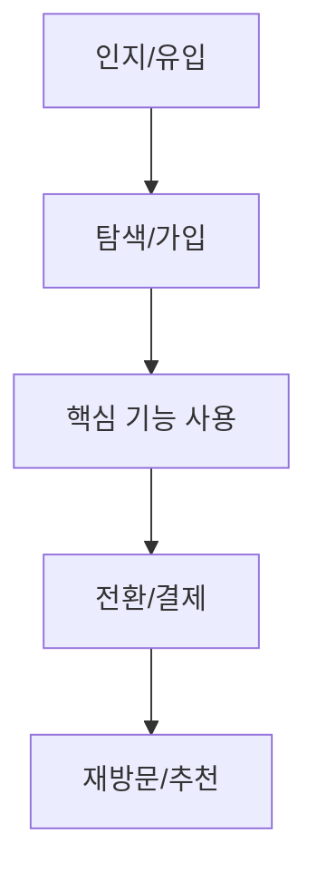
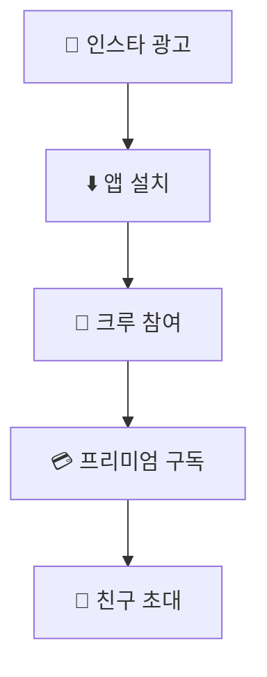

# 사용자 여정 (User Journey) 작성 가이드

## 개요

사용자 여정(User Journey)은 고객이 서비스를 인지하고, 사용하고, 재방문하는 전체 과정을 설명합니다.
**Mermaid 다이어그램만 있으면 FAIL!** 반드시 5단계 텍스트 설명이 필수입니다.

---

## 🚨 치명적 오류 (FAIL 조건)

### ❌ Mermaid 다이어그램만 있는 경우

```markdown
### 사용자 여정


```

**문제**: 다이어그램만 있고 텍스트 상세 설명 없음 → **FAIL!**

---

## ✅ 올바른 작성법

### 필수 5단계

모든 기획서에 다음 5단계를 **텍스트로 상세 설명**해야 합니다:

| 단계 | 설명 | 예시 |
|------|------|------|
| 1. 인지/유입 | 서비스를 처음 알게 되는 경로 | SNS 광고, 검색, 친구 추천 |
| 2. 탐색/가입 | 서비스에 접근하고 가입하는 과정 | 앱 설치, 회원가입, 소셜 로그인 |
| 3. 핵심 기능 사용 | 주요 기능을 체험하는 과정 | 상품 검색, 콘텐츠 소비, 매칭 |
| 4. 전환/결제 | 유료 전환 또는 핵심 행동 | 구독, 구매, 예약 |
| 5. 재방문/추천 | 재사용 및 확산 유도 | 푸시 알림, 리뷰, 친구 초대 |

---

## 📋 템플릿

### 앱/웹 서비스용

```markdown
### 사용자 여정 (User Journey)

1. **인지/유입**
   - [구체적 유입 경로] (예: 인스타그램 피트니스 인플루언서 광고)
   - [보조 유입 경로] (예: 친구 추천 링크, 앱스토어 검색)

2. **탐색/가입**
   - [첫 접점 행동] (예: 앱스토어에서 앱 다운로드)
   - [가입 방식] (예: 카카오/구글 소셜 로그인으로 30초 내 가입)
   - [온보딩] (예: 관심사 선택, 목표 설정 3단계 튜토리얼)

3. **핵심 기능 사용**
   - [주요 기능 체험] (예: 내 위치 기반 러닝 크루 검색)
   - [첫 성공 경험] (예: 근처 크루 참여 신청, 첫 러닝 완료)
   - [핵심 가치 전달] (예: 함께 달리는 즐거움 체험)

4. **전환/결제**
   - [무료 사용 기간] (예: 7일 무료 체험 후)
   - [유료 전환 트리거] (예: 프리미엄 기능 안내 - 상세 통계, 무제한 크루)
   - [결제 방식] (예: 월 $5.99 인앱 결제)

5. **재방문/추천**
   - [재방문 유도] (예: 주간 러닝 목표 달성 푸시 알림)
   - [참여 유지] (예: 크루 내 랭킹 시스템, 배지 획득)
   - [추천 유도] (예: 친구 초대 시 1개월 무료, 크루 공유 기능)
```

### 오프라인 비즈니스용

```markdown
### 고객 여정 (Customer Journey)

1. **인지**
   - SNS 인플루언서 방문 후기로 매장 인지
   - 네이버 지도 검색 → 높은 평점 확인

2. **방문**
   - 주말 오후, 친구와 함께 매장 방문
   - 인스타그래머블한 외관으로 첫인상 형성

3. **체험**
   - 직원 맞춤 상담 (5분 내)
   - 3-5개 제품 테스트 → 취향 파악
   - 제품 사용법 시연

4. **구매**
   - 기본 패키지 구매 (5만원대)
   - 기프트 패키지 업셀 제안
   - 멤버십 가입 유도 (10% 할인)

5. **재방문**
   - 시즌 신제품 출시 알림 (카카오톡)
   - 월 1회 VIP 데이 초대
   - 리뷰 작성 시 포인트 적립
```

---

## 🎨 시각 자료 활용법

Mermaid 다이어그램은 **보조 시각 자료**로 텍스트 설명과 함께 사용하세요.

### 올바른 사용 예

```markdown
### 사용자 여정 (User Journey)

1. **인지/유입**: 인스타그램 광고 클릭 → 앱스토어 이동
2. **탐색/가입**: 앱 다운로드 → 카카오 로그인 (30초)
3. **핵심 기능 사용**: 위치 기반 크루 검색 → 첫 러닝 참여
4. **전환/결제**: 7일 무료 체험 → 월 $5.99 프리미엄 구독
5. **재방문/추천**: 주간 목표 푸시 → 친구 초대 공유

**시각화:**

```

---

## 📊 단계별 KPI 연결

각 단계에 측정 가능한 KPI를 연결하면 더 완성도 높은 기획서가 됩니다.

| 단계 | 주요 KPI | 목표값 |
|------|----------|--------|
| 인지/유입 | 앱 설치 수 | 10,000/월 |
| 탐색/가입 | 가입 전환율 | 60% |
| 핵심 기능 | DAU, 첫 기능 사용률 | 5,000명, 80% |
| 전환/결제 | 유료 전환율 | 5% |
| 재방문 | Day 7 리텐션 | 30% |

---

## 자주 하는 실수 TOP 5

1. **Mermaid 다이어그램만 제시** → 텍스트 설명 필수!
2. **단계별 구체적 행동 없음** → "가입한다" 대신 "카카오 로그인"
3. **재방문/추천 단계 누락** → 모든 5단계 필수!
4. **서비스 특성 미반영** → 템플릿 그대로 복사 금지!
5. **전환 트리거 모호** → 왜 결제하는지 명확히!

---

## 업종별 예시

### 1. 커머스 앱

```markdown
1. **인지**: 인스타그램 타겟 광고 (관심사 기반)
2. **탐색**: 앱 설치 → 카테고리 브라우징 → 위시리스트 추가
3. **핵심 사용**: 상품 상세 보기 → 리뷰 확인 → 장바구니 담기
4. **전환**: 첫 구매 10% 할인 → 간편결제로 3분 내 완료
5. **재방문**: 배송 완료 알림 → 리뷰 작성 유도 → 포인트 적립
```

### 2. SaaS B2B

```markdown
1. **인지**: 구글 검색 "업무 자동화 툴" → 랜딩 페이지
2. **탐색**: 14일 무료 체험 신청 → 데모 영상 시청
3. **핵심 사용**: 첫 워크플로우 생성 → 팀원 초대 → 자동화 실행
4. **전환**: 무료 기간 종료 → 팀 플랜 $29/월 결제
5. **재방문**: 주간 리포트 이메일 → 신기능 웨비나 → 연간 플랜 업그레이드
```

### 3. 콘텐츠 플랫폼

```markdown
1. **인지**: 유튜브 크리에이터 추천 → 링크 클릭
2. **탐색**: 무료 콘텐츠 3개 체험 → 관심 분야 선택
3. **핵심 사용**: 데일리 콘텐츠 소비 → 노트 기능 활용
4. **전환**: 프리미엄 전용 콘텐츠 미리보기 → 월 9,900원 구독
5. **재방문**: 아침 7시 콘텐츠 알림 → 학습 연속 기록 배지 → 친구 추천 1개월 무료
```
